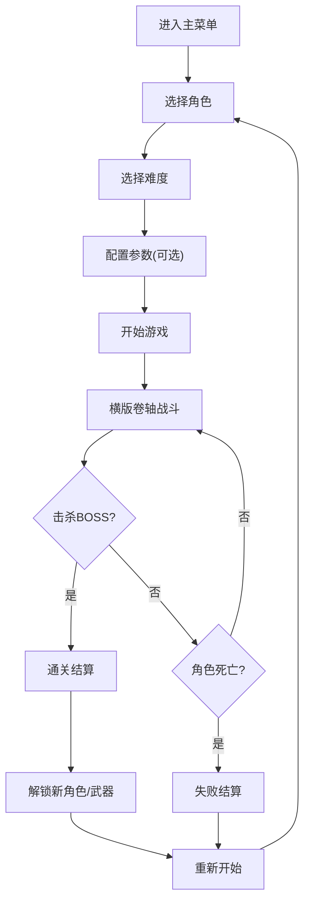

## 1. 产品概述
基于 Vue3+TS+PixiJS 开发的像素横版卷轴动作联机闯关游戏，支持最多2人同屏组队，通过击杀小怪与BOSS通关，具备完整的角色成长、AI怪物、道具系统、难度选择及配置面板功能。

- **核心目标**: 提供流畅的横版动作游戏体验，支持多人协作闯关
- **目标用户**: 像素游戏爱好者、横版动作游戏玩家
- **产品价值**: 前端纯游戏实现，无需后端，可快速启动体验

## 2. 核心功能

### 2.1 用户角色
| 角色 | 注册方式 | 核心权限 |
|------|----------|----------|
| 玩家 | 本地启动 | 开始游戏、选择角色、配置参数、闯关游戏 |

### 2.2 功能模块
1. **主菜单**: 游戏开始、角色选择、难度选择、设置面板
2. **游戏场景**: 横版卷轴地图、角色控制、怪物AI、道具掉落
3. **角色系统**: 普攻、跳跃、专属技能、血量/蓝量显示
4. **怪物系统**: 巡逻/追击/远程施法AI、BOSS战
5. **道具系统**: 回血道具、暴击增益道具
6. **配置面板**: 怪物参数配置、地图参数配置
7. **解锁系统**: 通关解锁新角色与武器

### 2.3 页面详情
| 页面名称 | 模块名称 | 功能描述 |
|---------|---------|----------|
| 主菜单 | 游戏标题 | 像素风格游戏Logo，动态闪烁效果 |
| 主菜单 | 角色选择 | 展示可选角色，显示角色属性与技能 |
| 主菜单 | 难度选择 | 普通/困难双难度切换，影响怪物属性 |
| 主菜单 | 设置按钮 | 打开怪物/地图参数配置面板 |
| 游戏场景 | HUD界面 | 显示角色血量、蓝量、分数、关卡信息 |
| 游戏场景 | 游戏画布 | PixiJS渲染的横版卷轴战斗场景 |
| 游戏场景 | 技能栏 | 显示普攻、跳跃、技能按键提示 |
| 结算界面 | 通关/失败 | 显示通关奖励、解锁内容、重新开始选项 |

## 3. 核心流程

玩家进入主菜单，选择角色与难度，可选进入配置面板调整参数，开始游戏后进入横版卷轴战斗场景，击杀沿路小怪与BOSS获得道具与分数，通关后解锁新角色与武器，失败可重新开始。

## 4. 用户界面设计

### 4.1 设计风格
- **主色调**: 像素复古风格，深色背景(#1a1a2e) + 霓虹蓝(#00d9ff) + 像素红(#ff6b6b)
- **按钮样式**: 像素边框按钮，悬停时发光效果，按下时下沉动画
- **字体**: 像素字体 "Press Start 2P"，标题24px，正文14px
- **布局风格**: 像素网格布局，居中对齐，复古CRT扫描线效果
- **图标风格**: 8-bit像素风格图标，emoji配合像素化处理

### 4.2 页面设计概述
| 页面名称 | 模块名称 | UI元素 |
|---------|---------|--------|
| 主菜单 | 标题区 | 像素Logo，渐变色文字，背景粒子动画 |
| 主菜单 | 选择区 | 角色卡片，难度切换开关，像素边框 |
| 主菜单 | 按钮区 | 开始按钮，设置按钮，像素风格 |
| 游戏场景 | HUD | 血量条(红色)，蓝量条(蓝色)，分数数字 |
| 游戏场景 | 画布 | 像素风格地图，角色精灵，怪物精灵 |
| 游戏场景 | 技能栏 | 键盘按键提示，冷却时间显示 |
| 配置面板 | 表单 | 滑块控件，输入框，保存/重置按钮 |

### 4.3 响应式
- Desktop-first，固定画布尺寸 1280x720
- 自适应窗口缩放，保持像素比例
- 支持键盘操作 WASD/方向键移动，JKL攻击/跳跃/技能

### 4.4 游戏场景设计
- **环境**: 像素风格横版地图，多层卷轴背景
- **光照**: 复古像素明暗对比，不使用复杂光照
- **相机**: 跟随角色的横向滚动相机
- **动画**: 角色帧动画，攻击特效，受击闪烁
- **特效**: 像素粒子系统，技能光效，掉落物闪烁
