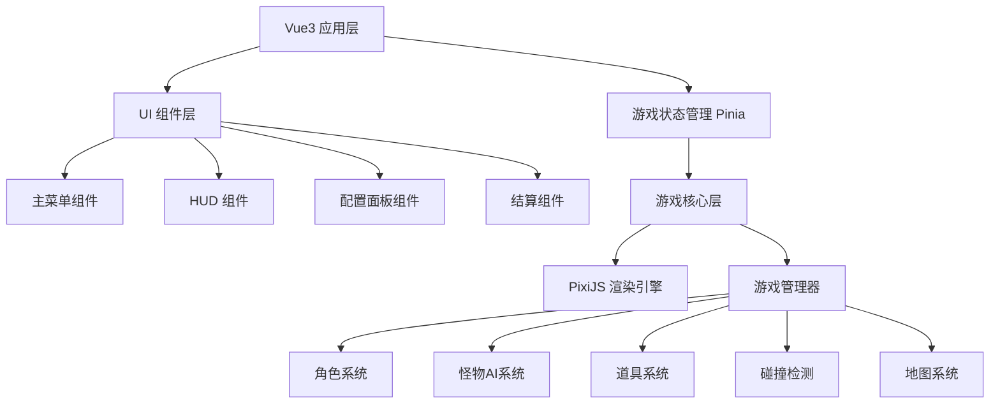
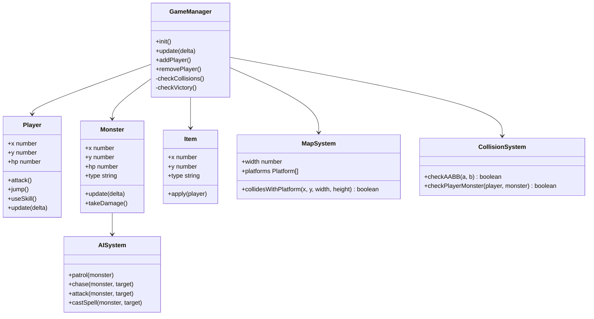

## 1. 架构设计



## 2. 技术描述

- **前端框架**: Vue@3.4 + TypeScript@5.4
- **游戏引擎**: PixiJS@7.4 (2D渲染)
- **状态管理**: Pinia@2.1
- **构建工具**: Vite@5.2
- **样式方案**: SCSS + CSS Modules
- **纯前端实现**: 无后端，所有数据本地存储 localStorage

## 3. 目录结构

```
src/
├── components/          # Vue组件
│   ├── MainMenu.vue     # 主菜单
│   ├── GameHUD.vue      # 游戏HUD
│   ├── ConfigPanel.vue  # 配置面板
│   └── ResultModal.vue  # 结算弹窗
├── game/                # 游戏核心逻辑
│   ├── GameManager.ts   # 游戏管理器
│   ├── Player.ts        # 玩家角色
│   ├── Monster.ts       # 怪物基类
│   ├── Boss.ts          # BOSS类
│   ├── Item.ts          # 道具类
│   ├── Map.ts           # 地图系统
│   ├── Collision.ts     # 碰撞检测
│   └── AI.ts            # 怪物AI系统
├── stores/              # Pinia状态
│   └── gameStore.ts     # 游戏状态
├── types/               # TypeScript类型
│   └── game.ts          # 游戏类型定义
├── config/              # 配置文件
│   ├── monsters.ts      # 怪物配置
│   ├── maps.ts          # 地图配置
│   └── characters.ts    # 角色配置
├── assets/              # 静态资源
│   ├── sprites/         # 精灵图
│   └── sounds/          # 音效
├── App.vue
└── main.ts
```

## 4. 路由定义

| 路由 | 用途 |
|------|------|
| / | 主菜单页面 |
| /game | 游戏场景页面 |

## 5. 核心数据模型

### 5.1 角色数据模型

```typescript
interface Character {
  id: string;
  name: string;
  unlocked: boolean;
  stats: {
    hp: number;
    maxHp: number;
    mp: number;
    maxMp: number;
    attack: number;
    defense: number;
    speed: number;
    jumpForce: number;
  };
  skill: {
    name: string;
    damage: number;
    cooldown: number;
    mpCost: number;
  };
}
```

### 5.2 怪物数据模型

```typescript
interface MonsterConfig {
  id: string;
  name: string;
  type: 'normal' | 'ranged' | 'boss';
  hp: number;
  attack: number;
  speed: number;
  patrolRange: number;
  chaseRange: number;
  attackRange: number;
  attackCooldown: number;
  dropRate: number;
}
```

### 5.3 地图数据模型

```typescript
interface MapConfig {
  id: string;
  name: string;
  width: number;
  height: number;
  platforms: Platform[];
  spawnPoints: { x: number; y: number }[];
  bossSpawnPoint: { x: number; y: number };
  monsterSpawns: MonsterSpawn[];
  backgroundLayers: BackgroundLayer[];
}

interface Platform {
  x: number;
  y: number;
  width: number;
  height: number;
}
```

### 5.4 游戏状态模型

```typescript
interface GameState {
  phase: 'menu' | 'playing' | 'paused' | 'victory' | 'defeat';
  difficulty: 'normal' | 'hard';
  currentLevel: number;
  score: number;
  players: PlayerState[];
  unlockedCharacters: string[];
  unlockedWeapons: string[];
}

interface PlayerState {
  id: number;
  characterId: string;
  x: number;
  y: number;
  hp: number;
  mp: number;
  facing: 'left' | 'right';
  isJumping: boolean;
  isAttacking: boolean;
  skillCooldown: number;
  buffs: Buff[];
}

interface Buff {
  type: 'crit' | 'heal';
  duration: number;
  value: number;
}
```

## 6. 游戏核心类关系



## 7. 技术约束

- **纯前端实现**: 所有逻辑在浏览器端运行，使用 localStorage 存储解锁进度
- **Canvas渲染**: 使用 PixiJS 进行高性能 2D 渲染
- **键盘输入**: 支持 WASD/方向键移动，J/K/L 攻击/跳跃/技能
- **本地双人**: 同屏双人使用不同按键配置 (P1: WASD+JKL, P2: 方向键+123)
- **像素风格**: 所有精灵使用像素风格渲染，开启像素对齐
